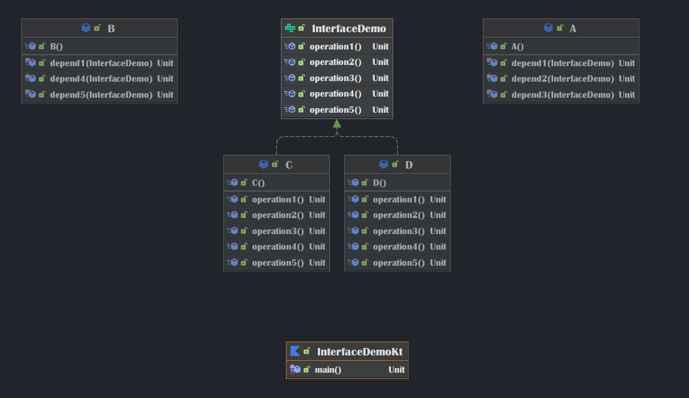

# 设计模式常用七大原则

[TOC]

## 1. 单一职责原则

**Sigle Responsibility Principle.**

基本介绍

对类来说,==一个类应该只负责一项职责==.如果A负责两个不同的职责: 职责1 , 职责2. 当职责1需求变更而改变A时,可能造成职责2执行错误,所以需要将类A的粒度分解为A1,A2.

注意事项

* 降低类的复杂度,一个类只负责一项职责.
* 提高类的可读性,可维护性.
* 降低变更引起的风险.
* 通常情况下,我们应当遵守单一职责原则,只有逻辑足够简单,才可以在代码级违反.当类中方法够少,可以在方法级别保持单一职责原则.

## 2. 接口隔离原则

**Interface Segregation Principle**

基本介绍

客户端==不应该依赖它不需要的接口==,即一个类对另一个类的依赖应该建立在最小的接口上.

错误演示

* 接口有五个方法,C和D为实现类.
* A和B通过接口依赖于C和D,但是都只依赖部分方法.
* 但是C和D却需要全部实现接口的方法.

 改进

* 当初的一个接口根据依赖关系拆分成三个接口

## 3. 依赖倒转原则

**Dependence Inversion Principle**

基本介绍

依赖倒转原则是指: 

1. 高层模块不应该依赖底层模块,二者都应该依赖其抽象.

2. 抽象不应该依赖细节,细节应该依赖抽象.

3. 依赖倒转的中心思想是面向接口编程.

4. 设计理念:

   > 相对于细节的多变性,抽象的东西要稳定得多,以抽象为基础搭建的架构要稳定的多.在java中,抽象指的是接口或抽象类,细节就是具体的实现类.

5. 使用接口或抽象类的目的是制定好规范,而不涉及任何具体的操作,把展现细节的任务交给他们的实现类去完成.

补充

依赖关系传递的三种方式:

* 接口传递 : 

  > 接口方法形参包含依赖

* 构造方法传递 : 

  > 实现类构造方法包含依赖

* setter方法传递

  > 实现类中通过setter方法设置依赖,再而从业务方法中使用

注意事项

1. 底层模块尽量都要有抽象类或接口,或者两者都有,程序稳定性更好.
2. 变量的声明类型尽量是抽象类或接口,这样我们的变量引用和实际对象间,就存在一个缓冲层,利用层序扩展和优化.
3. 继承时遵循里氏替换原则.

## 4. 里氏替换原则

前导

> OO(Object Oriented)的继承性的思考和说明:
>
> 1. 继承包含含义: 父类中凡是已经实现好的方法,实际上是在设定规范和契约,虽然不强制要求所有子类必须遵循,但是如果子类对这些方法任意修改,就会对整个继承体系造成破坏.
> 2. 继承在给程序设计带来便利的同时,也带来了弊端.比如侵入性,降低程序的可移植性,增加对象间的耦合性.父类修改时需要兼顾到所有子类,并且涉及到的子类功能可能发生故障.
> 3. 里氏替换原则指出了如何正确使用继承.

基本介绍

**Liskov Substitution Principle**

* 里氏替换原则在1988年,由麻省理工学院的一位里姓女士提出.
* 如果对每个类型为T1的对象o1,都有类型为T2的对象o2,使得以T1定义的所有程序P在所有的对象o1都代换成o2时,程序P的行为没有发生变化,那么类型T2是类型T1的子类型.即: ==所有引用基类的地方必须能透明的使用其子类的对象.==
* 使用继承时,遵循里氏替换原则,在子类中尽量不要重写父类的方法.
* 继承实际上让两个类耦合性增强了,在适当的情况下,可以通过聚合,组合,依赖来解决问题.

## 5. 开闭原则

**Open Closed Principle**

基本介绍

2. 一个软件实体如类,模块和函数应该对扩展开放(对提供方),对修改关闭(对使用方).用抽象构建框架,用实现扩展细节.
3. 当软件需要变化时,尽量通过扩展软件实体的行为来实现变化,而不是通过修改已有的代码来实现变化.
>*  编程中遵循其他原则,以及使用设计模式的目的就是遵循开闭原则.
>*  开闭原则是编程中最基础,最重要的设计原则.

## 6. 迪米特法则

**Demeter Principle**

基本介绍

>* 一个对象应该与其他对象保持最少的了解.
>
>* 类与类关系越密切,耦合度就越大.
3. 迪米特法则又叫最少知道与原则,==即一个类对自己依赖的类知道的越少越好==.也就是说,对于被依赖的类不管多复杂,都尽量将逻辑封装在类的内部.对外除了提供的public方法,不对外泄露任何信息.

4. 迪米特法则更简单的定义: 只与直接的朋友通信.

   > ==直接的朋友:== 
   >
   > ​		每个对象都会与其他对象有耦合关系,只要两个对象之间有耦合关系,我们就说这两个对象之间是朋友关系.耦合的方式很多: 依赖,关联,组合,聚合等.其中,我们称出现在成员变量,方法参数,方法返回值中的类为直接的朋友,而出现在局部变量中的类不是直接的朋友.也就是说,陌生的类最好不要以局部变量的形式出现在类的内部.

注意事项

1. 迪米特法则的核心是降低类之间的耦合.
2. 由于每个类都减少了不必要的依赖,因此迪米特法则只是要求降低类(对象)之间的耦合关系,并不是要求完全没有依赖关系.

## 7. 合成复用原则

**Composite Reuse Principle**

基本介绍

* 原则是尽量使用合成/聚合的方式,而不是使用继承.

## 设计原则核心思想

1. 找出应用中可能需要变化之处,把他们独立出来,不要和那些不需要变化的代码混在一起.
2. 针对接口编程,而不是针对实现编程.
3. 为交互对象之间的松耦合设计而努力.

